## Commands:ssssssss
#### /rank [region] [username] 
- Get a user's soloqueue rank, lp and winrate.

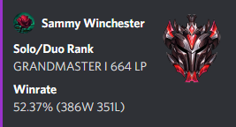

#### /flexrank [region] [username]
- Get a user's 5x5 flex rank, lp and winrate.

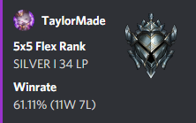

#### /championstats [region] [username] [champion] [queue]
- View a user's cs, kda, winrate on a specified champion and queue.

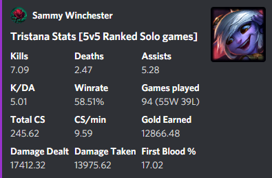

#### /duostats [region] [user1] [user2] [queue]
- Get two player's duo winrate + total games played together for current season
- Also displays the duo's 10 most-played pairing(s) and winrate

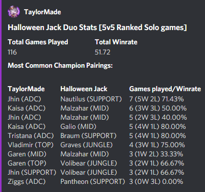

#### /mostplayed [region] [username] [queue]
- View a user's top 10 most played champions + stats for a selected game queue.

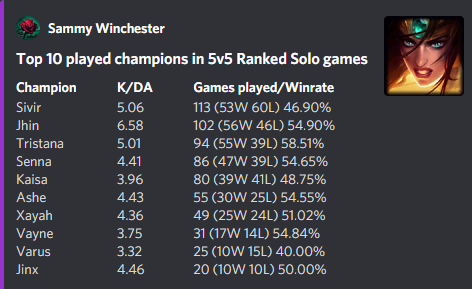

#### /mastery [region] [username] [champion]
- View a user's mastery level on a specified champion.

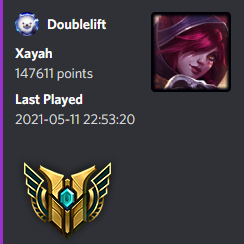

#### /topmastery [region] [username]
- Display a user's top 10 champions, by total mastery points.

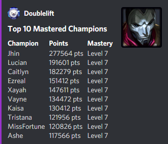

#### /livegame [region] [username]
- Display live game info if specified user is currently in game.

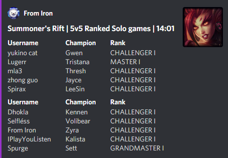

#### /tips [champion]
- Get tips for playing with, and against, a champion 

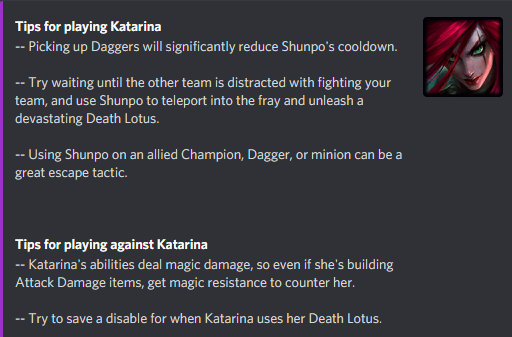

#### /abilities [champion]
- Get a formated message containing champion description, abilities etc.

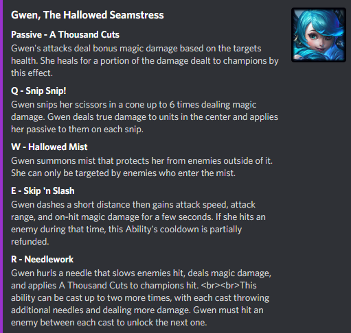

#### /lore [champion]
- Read up on a champion's lore/background

#### /free [region]
- View the free champion rotation for the current week.

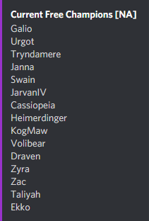
